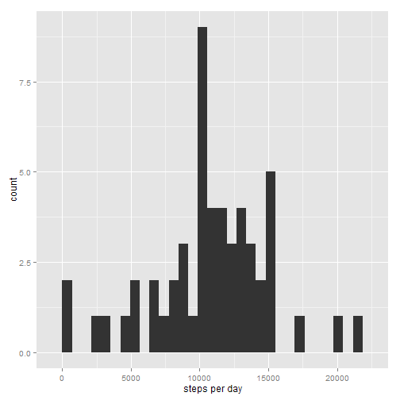
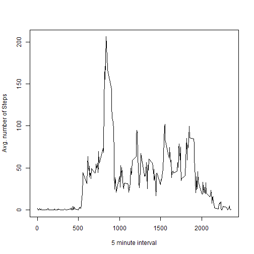
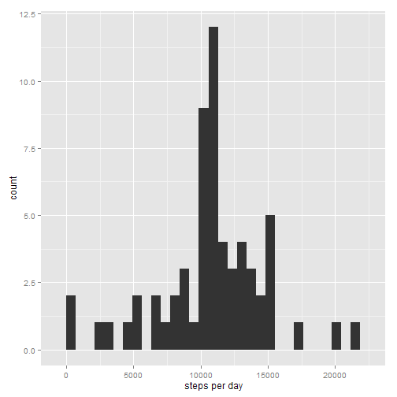
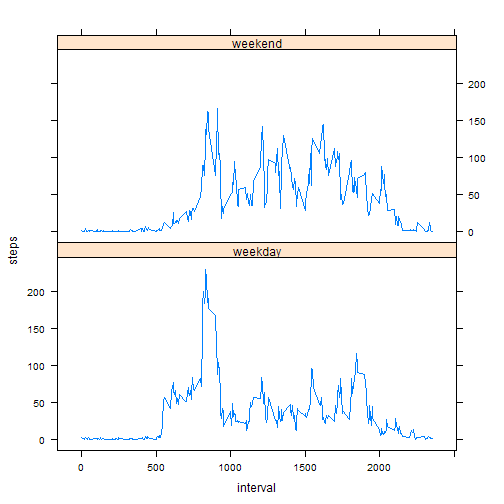

# Reproducible Research: Peer Assessment 1


## Loading and preprocessing the data

```r
x = read.csv("activity.csv")
xclean = x[complete.cases(x),]
```


## What is mean total number of steps taken per day?


```r
library(plyr)
library(ggplot2)
spd = ddply(xclean, .(date), summarise, steps=sum(steps))
qplot(spd$steps, xlab="steps per day")
```

```
## stat_bin: binwidth defaulted to range/30. Use 'binwidth = x' to adjust this.
```

 

```r
spd = spd[complete.cases(spd),]
#mean
mean(spd$steps)
```

```
## [1] 10766
```

```r
#median 
median(spd$steps)
```

```
## [1] 10765
```

## What is the average daily activity pattern?

```r
apd = ddply(xclean, .(interval), summarise, steps = mean(steps))
plot(apd$interval,apd$steps, type = "l", ylab = "Avg. number of Steps", xlab = "5 minute interval")
```

 

```r
#Interval with maximum value
apd = apd[complete.cases(apd),]
apd[apd$steps==max(apd$steps),]
```

```
##     interval steps
## 104      835 206.2
```


## Inputing missing values

```r
length(x$steps[is.na(x$steps)])
```

```
## [1] 2304
```

```r
colnames(apd)[2]= "avgsteps"
combined = arrange(join(x,apd),interval)
```

```
## Joining by: interval
```

```r
combined$steps[is.na(combined$steps)] = combined$avgsteps[is.na(combined$steps)]
fixed = ddply(combined, .(date),summarise, steps = sum(steps))
qplot(fixed$steps,xlab = "steps per day")
```

```
## stat_bin: binwidth defaulted to range/30. Use 'binwidth = x' to adjust this.
```

 

```r
mean(fixed$steps)
```

```
## [1] 10766
```

```r
median(fixed$steps)
```

```
## [1] 10766
```

```r
sum(fixed$steps) -sum(spd$steps)
```

```
## [1] 86130
```


## Are there differences in activity patterns between weekdays and weekends?

```r
wd = weekdays(as.Date(combined$date))
daydata = transform(combined, day=wd)
daydata$wk = ifelse(daydata$day %in% c("Saturday", "Sunday"),"weekend", "weekday")
avgweek = ddply(daydata, .(interval, wk), summarise, steps=mean(steps))

library(lattice)
xyplot(steps ~ interval | wk, data = avgweek, type="l", layout = c(1, 2))
```

 
